무중단 배포는 여러 방법이 있는데, 그 중 NGINX를 이용해 내부 포트를 바꿔 무중단 배포를 하는 방식에 대해 알아보았습니다.

## 무중단 배포 방식

저는 1대의 Nginx와 2대의 Spring Boot jar를 사용해서 진행했습니다.

아래와 같이 사용자가 80번 포트로 접속하면 Nginx는 기존 버전의 서버 포트인 8081로 전달합니다.

8082 포트는 현재 연결된 상태가 아니므로 어떠한 요청도 받지 못하는 상태입니다.

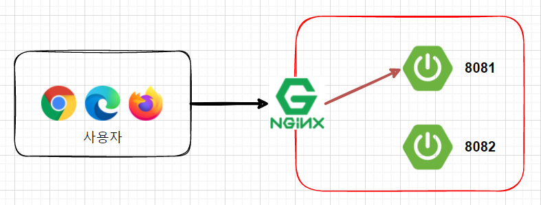

신규 버전의 배포가 필요하면 Nginx와 연결되지 않은 8082로 배포합니다.

이 과정에서 Nginx는 8081 포트와 연결되어 있기 때문에 신규 배포가 아무런 영향을 끼치지 못합니다.

신규 배포가 정상적으로 완료되면 Nginx에 연결된 포트를 8082로 변경하고 reload 합니다.

**Nginx Reload는 1초 이내에 실행이 완료됩니다.**

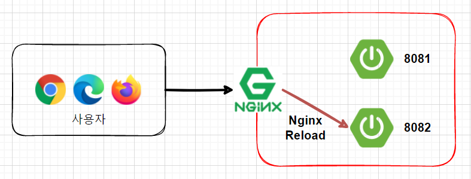

## Spring Boot 세팅

테스트를 진행하기 위해 Spring Boot를 하나 생성하고 포트 번호를 설정해줍니다.

resources > application-test1.properties

```
server.port=8081
```

resources > application-test2.properties

```
server.port=8082
```

그 다음 웹 사이트에 접속했을 때 어떤 포트를 통해 접속했는지 화면에 보여주는 API를 하나 생성합니다.

```
package com.example.demo.controller;

import lombok.RequiredArgsConstructor;
import org.springframework.core.env.Environment;
import org.springframework.web.bind.annotation.GetMapping;
import org.springframework.web.bind.annotation.RestController;

import java.util.Arrays;
import java.util.List;

@RequiredArgsConstructor
@RestController
public class DemoController {

    private final Environment env;

    @GetMapping("/")
    public String test() {
        List<String> profile = Arrays.asList(env.getActiveProfiles());
        List<String> realProfiles = Arrays.asList("test1", "test2");
        String defaultProfile = profile.isEmpty() ? "default" : profile.get(0);

        return profile.stream()
                .filter(realProfiles::contains)
                .findAny()
                .orElse(defaultProfile);
    }
}
```

## 프로젝트 Build

intelliJ의 경우 Maven package를 찾아 더블 클릭하면 Build가 완료됩니다. (이클립스도 이러한 방법을 제공하는지 확인해보지는 않았습니다.)

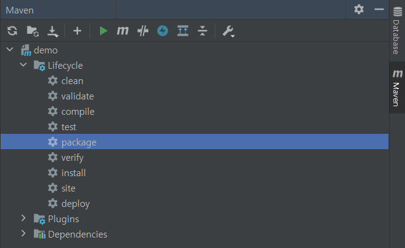

또 다른 방법으로는 Terminal 창에 아래 명령어를 입력하는 것입니다.

```
./mvnw package
```

build가 완료되면 target에 jar 파일이 생성된 것을 확인할 수 있습니다.

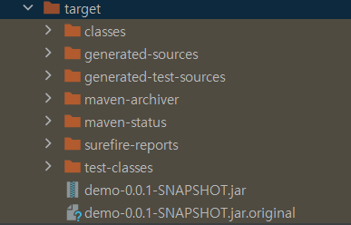

이제 서버에 접속하여 test1으로 jar 파일을 백그라운드 실행시킵니다.

```
nohup java -jar -Dspring.profiles.active=test1 *.jar &
```

그 후 아래 명령어를 통해 현재 port를 확인해보면

```
sudo netstat -tnlp
```

8081 포트로 실행된 것을 알 수 있습니다.

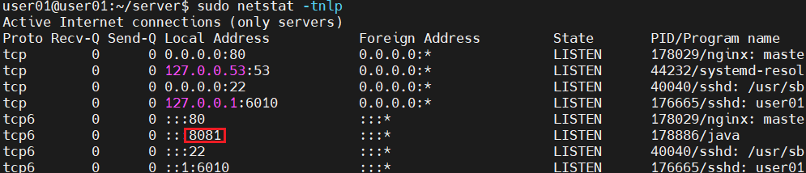

8081번 포트로 접속해보면 test1이라고 뜨는 것을 확인할 수 있습니다.

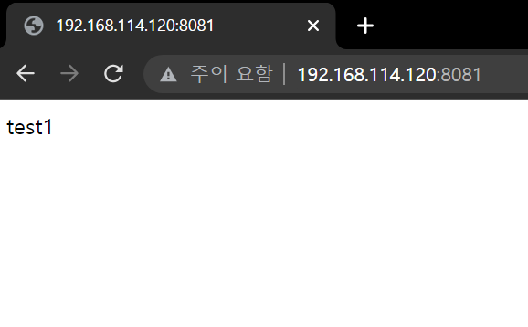
## Nginx 설치

이제 80 포트로 접속했을 때 8081 포트에 대한 웹을 보여줄 수 있도록 Nginx를 설정하겠습니다.

먼저, Nginx를 설치해줍니다. (현재 실습 환경은 VMware로 접속한 linux 입니다.)

```
sudo apt install nginx
```

설치가 완료되면 명령어를 통해 nginx의 상태를 확인해봅니다.

```
service nginx status
```

아래와 같이 현재 nginx가 정상적으로 실행되는 모습을 볼 수 있습니다.

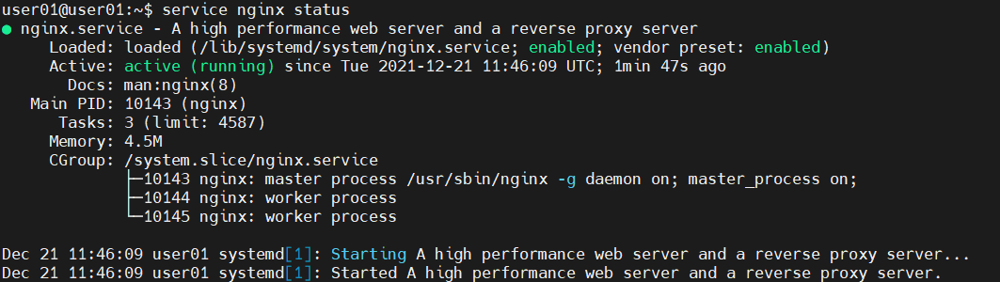

이제 8081 포트로 프록싱 될 수 있게 conf 파일을 설정해야 합니다.

**/etc/nginx/nginx.conf** 파일을 열어서 확인해보면 아래와 같은 문구를 볼 수 있습니다.

```
##
# Virtual Host Configs
##

include /etc/nginx/conf.d/*.conf;
include /etc/nginx/sites-enabled/*;
```

해당 내용은 nginx는 **/etc/nginx/conf.d/** 에 존재하는 모든 .conf 파일과 **/etc/nginx/sites-enabled/** 에 존재하는 모든 파일을 include 해온다는 뜻입니다.

여기서 우리가 건드릴 곳은 sites-enabled 입니다. 정확히는 sites-available에 설정 파일을 생성하고 그에 대한 심볼릭 링크를 sites-enabled에 생성해야 합니다.

그 다음 nginx를 restart하거나 reload하면 설정 파일의 내용들이 적용됩니다.

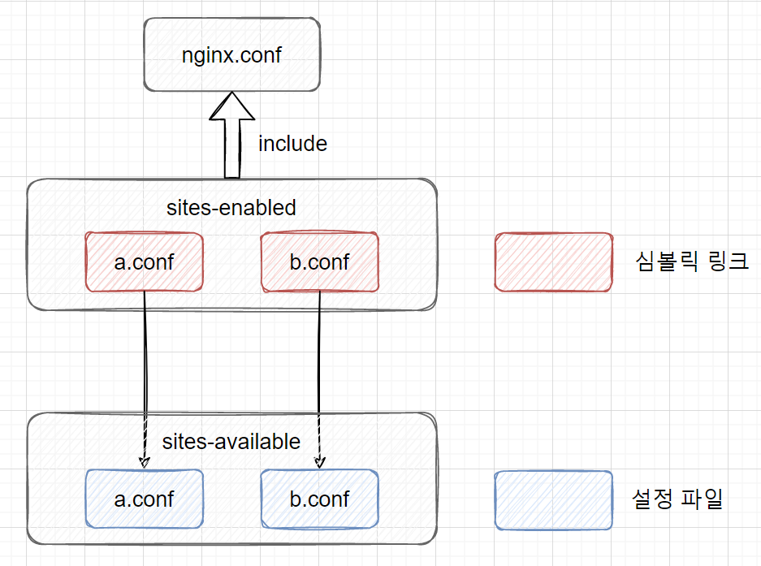

우선, /etc/nginx/sites-enabled 에 .conf 파일을 생성합니다. 여기서는 server.conf 로 생성했습니다.

```
server {
    listen 80;
    listen [::]:80;

    server_name _;

    include /etc/nginx/conf.d/service-url.inc;
    location / {
         proxy_pass $service_url;
         proxy_set_header X-Real-IP $remote_addr;
         proxy_set_header X-Forwarded-For $proxy_add_x_forwarded_for;
         proxy_set_header Host $http_host;
    }
}
```

그리고 /etc/nginx/conf.d/service-url.inc를 아래와 같이 설정합니다.

```
set $service_url http://192.168.114.120:8081;
```

그 후 아래 명령어를 통해 /etc/nginx/sites-enabled에 심볼릭 링크를 생성해줍니다.

```
sudo ln -s /etc/nginx/sites-available/server.conf /etc/nginx/sites-enabled
```

sites-enabled에 연결된 심볼릭 링크는 server.conf 외에는 모두 지워줘야 nginx.conf에 server.conf가 적용됩니다.

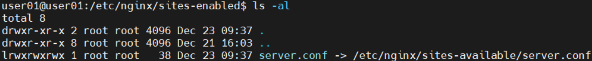

그 다음 nginx를 restart하거나 reload 해줍니다.

```
sudo service nginx restart
# 또는
sudo service nginx reload
```

이제 80번 포트로 접속하면 이전에 8081번 포트로 접속했을 때와 동일한 결과를 보여주는 것을 알 수 있습니다.

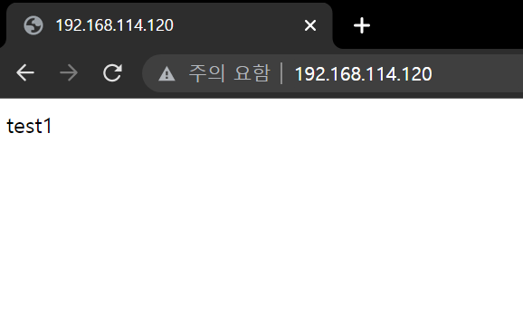

## 신규 버전으로 변경

신규 버전의 jar 파일을 nginx에서 사용하고 있지 않은 test2로 백그라운드 실행시킵니다.

```
nohup java -jar -Dspring.profiles.active=test2 *.jar &
```

명령어를 통해 확인해보면 8082 포트로 실행되는 프로그램이 생성된 것을 알 수 있습니다.

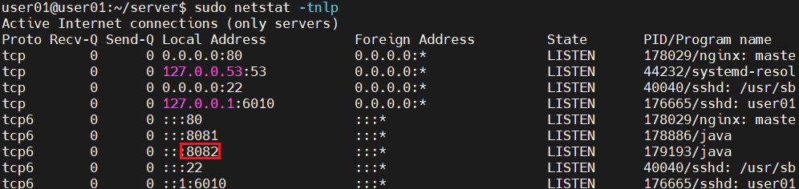

그리고 /etc/nginx/conf.d/service-url.inc의 port를 8082로 변경합니다.

```
set $service_url http://192.168.114.120:8081;
```

여기서는 신규 버전 배포이므로 무중단 배포를 위해 nginx를 reload 해줍니다.

```
sudo service nginx reload
```

그 후 80 포트로 접속했을 때 8082 포트인 test2를 불러오는 것을 확인할 수 있습니다.


이제 nignx에 연결되지 않은 이전 버전의 서버인 8081은 kill 시킵니다.

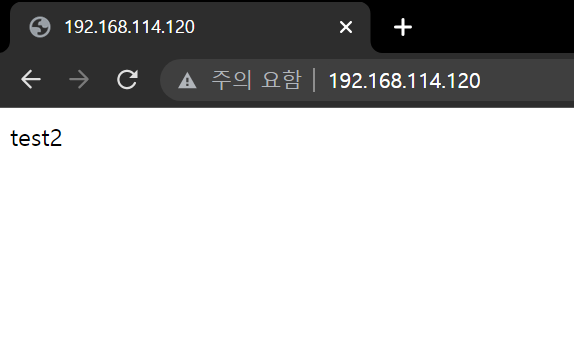

이렇게 하면 포트를 직접 kill 시켜야 하기 때문에, PID를 잘못 입력하는 순간 원하지 않은 프로그램을 종료 시킬 수 있다는 문제가 있습니다.

배포 과정에서 shell 스크립트를 통해 nginx에 연결되지 않은 port를 찾아 해당 포트로 jar를 실행시키고,

정상적인 배포가 완료되면 nginx에 해당 port를 연결한 다음 기존 port의 프로그램을 죽일 수 있도록 설정해야 합니다.

추후에 이 부분에 대해 더 알아보고 확인한 다음 공유하도록 하겠습니다.

## CentOS로 설정해보자!
위 내용에서 jar 파일을 실행시킨 다음 CentOS인 경우 아래 내용을 수행하면 됩니다.
CentOS의 경우 yum 저장소에 nginx가 없기 때문에 외부 저장소를 추가해야 합니다.
아래 내용을 입력하여 `/etc/yum.repos.d/nginx.repo` 파일을 생성해줍니다.
```
[nginx]
name=nginx repo
baseurl=https://nginx.org/packages/centos/$releasever/$basearch/
gpgcheck=0
enabled=1
```
그 다음 명령어를 통해 nginx를 설치합니다.
```
yum install -y nginx
```
제가 설정했던 환경에서는 방화벽이 존재하지 않기 때문에 방화벽과 관련된 내용은 생략하겠습니다. (방화벽이 존재하는 경우 설정이 필요합니다.)
nginx 설치가 완료되면 nginx를 활성화한 다음 실행시킵니다. (순서가 바뀌어도 괜찮습니다.)
```
sudo systemctl enable nginx
sudo systemctl start nginx
```
이제 `/etc/nginx/conf.d/default.conf` 파일을 변경하여 포트를 설정해줍니다.
```
server {
    listen        80;
    listen        [::]:80;
    
    ...
    
    include /etc/nginx/service-url.inc;
    
    location / {
        proxy_pass $service_url;
    }
}
```
파일 내에 include 시킨 /etc/nginx/service-url.inc 파일은 위의 리눅스 서버와 동일하게 작성이 됩니다.
```
set $service_url http://192.168.114.120:8081;
```
설정이 완료되면 nginx를 reload 합니다.
```
sudo systemctl reload nginx
```

### 참고

[https://devlog-wjdrbs96.tistory.com/309](https://devlog-wjdrbs96.tistory.com/309)

[https://velog.io/@damiano1027/Nginx-Nginx%EC%99%80-SpringBoot-%EB%82%B4%EC%9E%A5-Tomcat-%EC%97%B0%EB%8F%99](https://velog.io/@damiano1027/Nginx-Nginx%EC%99%80-SpringBoot-%EB%82%B4%EC%9E%A5-Tomcat-%EC%97%B0%EB%8F%99)
