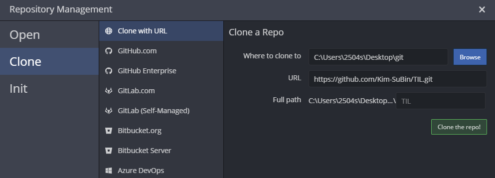
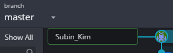
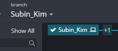
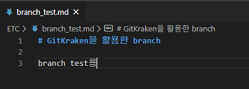
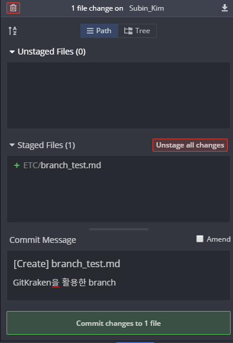
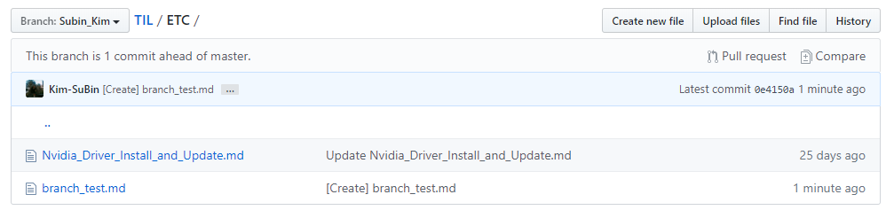
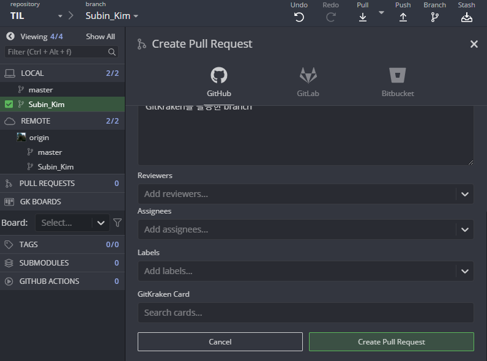
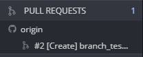
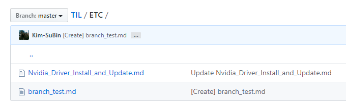
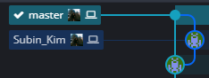

# GitKraken을 활용한 branch

[Tistory에 정리한 내용](https://subin-0320.tistory.com/9)

1. GitKraken에서 GitHub에 있는 Repository Clone

2. GitKraken에서 master에 우클릭 후 Create branch here을 누른다.

3. Create branch here을 누르면 생성되는 block에 branch 이름을 쓰고 enter를 눌러준다.

4. branch test를 위한 파일을 하나 만들어준다.

5. 생성한 branch에서 commit을 해준다.

6. 생성한 branch에서 push를 진행해준다.

7. 생성한 branch에서 우클릭 후 Start a pull request to origin from ... 을 누르고 뜨는 창에서 Create Pull Request 버튼을 눌러준다.

8. master에서 branch를 merge를 해준 후, push 한다.

