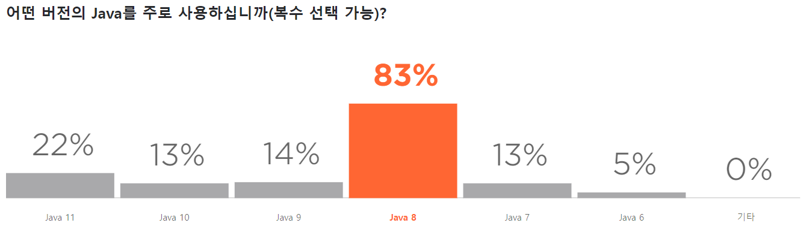

# 자바 8 소개
- LTS 버전
- 출시일 : 2014년 8월
- 자바 개발자 중 약 83%가 사용 중 ([2019년 jetbrains 설문조사](https://www.jetbrains.com/ko-kr/lp/devecosystem-2019/java/))

- LTS(Long-Time-Support)와 비-LTS 차이
    - 비-LTS 업데이트 제공 기간 : 짧음
    - 비-LTS 배포 주기 :  6개월
    - 비-LTS 지원 기간 : 배포 이후 6개월
    - LTS 배포 주기 : 3년 (매 6번째 배포판이 LTS가 된다.)
    - LTS 지원 기간 : 5년이상 (JDK를 제공하는 밴더와 이용하는 서비스에 따라 다름)
    - 실제 서비스 운영 환경(production)에서는 LTS 버전 권장
    - [Moving Java Forward Faster](https://mreinhold.org/blog/forward-faster)Mark Reinhold
    - 매년 3월과 9월에 새 버전 배포
- 주요 기능
    - 람다 표현식
    - 메소드 레퍼런스
    - 스트림 API
    - Optional<T>
    - ...