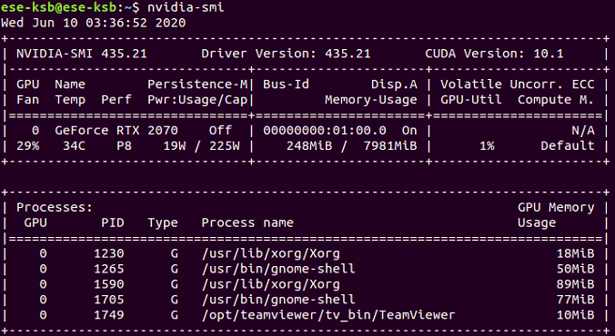
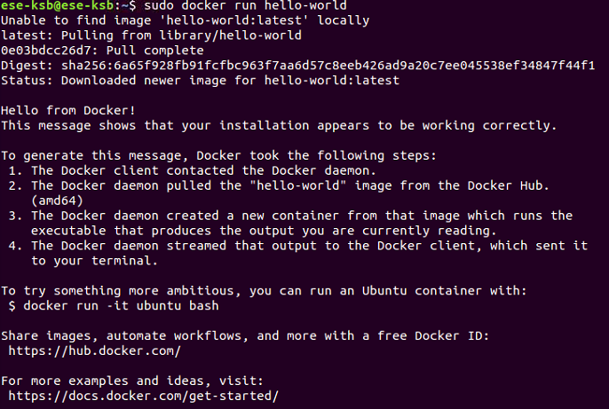
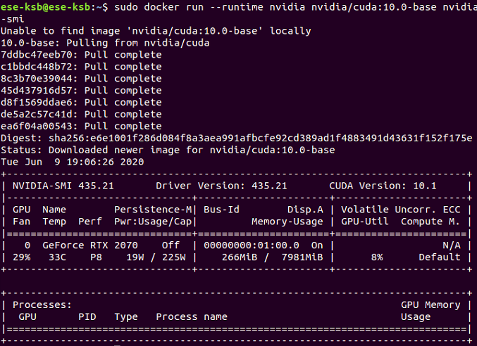

# Kubernetes

### 1. Docker install

[docker install](./docker_install.sh)  
docker가 정상적으로 설치되면 아래와 같다.

[nvidia-docker install](./nvidia-docker_install.sh)  
만약 nvidia driver가 설치되어 있으면 아래와 같다.

설치가 되어 있지 않다면, nvidia driver를 설치하고 업데이트 해준다.  
[nvidia driaver install and update](../ETC/Nvidia_Driver_install_and_Update.md)

nvidia driver를 설치하고 나면 nvidia-docker를 설치한다.
[nvidia-docker install](./nvidia-docker_install.sh)  
nvidia-docker가 설치되면 아래와 같다.

 

### 2. Kubernetes install

마스터 노트와 워커 노트의 공통적인 설치 영역은 아래와 같다.  
[Kubernetes install](./kubernetes_install.sh)  

마스터 노드일 경우 kubeadm init이라는 명령어를 통해 쿠버네티스를 초기화 시킨다.  
[Master Node install](./master_install.sh)  
쿠버네티스를 초기화시킨 노드가 마스터 노드가 되며 초기화 과정을 마치면 이 노드에 조인 할 수 있는 토큰 값을 포함한 kubeadm 명령어가 노출된다.
~~~
kubeadm join 192.168.0.3:6443 --token sybtdq.cv4oi3vp001zx27t \
    --discovery-token-ca-cert-hash sha256:0e95f085bb80b7f0c8423a9754cda8b2fcbd4bb3d3e194b8a8c354b57f32a7b4 
~~~
이 명령어를 워커 노드에 그대로 복사하여 실행시키면 워커 노드가 정상적으로 마스터 노드에 조인된다.

