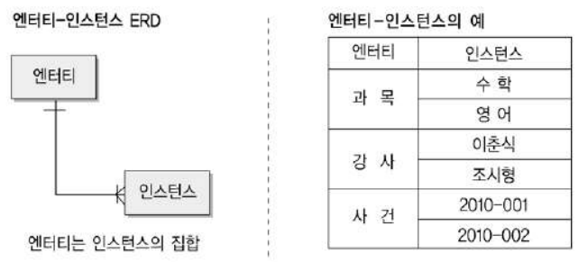
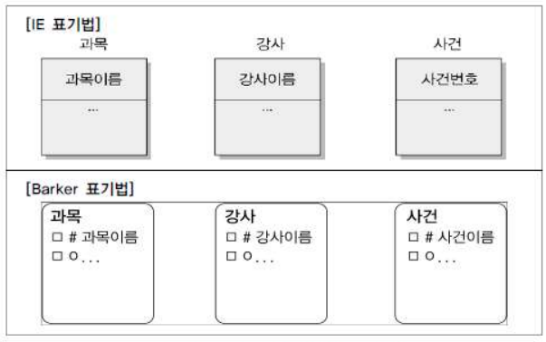

# 제2절 엔티티 (Entity)

## 1. 엔티티의 개념

- 업무에 필요하고 유용한 정보를 저장하고 관리하기 위한 집합적인 것 (Thing)
- 업무 활동상 지속적으로 관심을 가지고 있어야 하는 대상
- 대상들 간에 동질성을 지닌 인스턴스들이나 그들이 행하는 행위의 집합 ⇒ 인스턴스의 집합
- 인스턴스 : 엔티티 하나의 값
- 속성 : 엔티티에 속하는 개체들의 특성

## 2. 엔티티와 인스턴스에 대한 내용과 표기법

대부분 사각형으로 표현

엔티티와 인스턴스

엔티티에 대한 표기법

## 3. 엔티티의 특징

### 1. 업무에서 필요로 하는 정보

- 시스템을 구축하고자 하는 업무에서 필요로 하고 관리하고자 하는 정보여야 함
- 엔티티 도출할 때 업무 영역 내에서 관리할 필요가 있는지 판단하는 것이 중요

### 2. 식별이 가능해야 함

- 식별자에 의해 식별이 가능해야 함
- 각각의 업무적으로 의미를 가지는 인스턴스가 식별자에 의해 한 개씩만 존재
- 유일한 식별자는 그 엔티티의 인스턴스만의 고유한 이름

### 3. 인스턴스의 집합

- 영속적으로 존재하는 인스턴스의 집합
- 두 개 이상의 인스턴스

    ⇒ 엔티티뿐만 아니라 엔티티 간의 관계, 프로세스와의 관계 등 업무를 분석하고 설계하는 동안 설계자가 모든 업무에 대입해보고 검증해 보아야 할 중요한 개념

- 하나의 엔티티는 여러 개의 인스턴스 포함

### 4. 업무 프로세스에 의해 이용

- 업무 프로세스가 그 엔티티를 반드시 이용해야 함
- 업무 프로세스에 의해 CRUD (Create, Read, Update, Delete) 등이 발생하지 않는 고립된 엔티티의 경우, 엔티티를 제거하거나 누락된 프로세스가 존재하는지 살펴봐야 함

### 5. 속성 포함

- 엔티티는 반드시 속성이 포함되어 있어야 함
- 예외적으로 관계엔티티의 경우는 주식별자 속성만 가지고 있어도 엔티티로 인정

### 6. 관계 존재

- 엔티티는 다른 엔티티와 최소 한 개 이상의 관계가 존재해야 함
- 해당 업무 내에서 업무적인 연관성 (존재적, 행위적)을 가지고 다른 엔티티와 연관의 의미를 가지고 있어야 함
- 데이터 모델링을 하면서 관게를 생략하여 표현해야 하는 경우
    1. 통계성 엔티티 도출 :

        통계 업무를 위해 별도로 엔티티를 다시 정의하는 경우 생략

    2. 코드성 엔티티 도출 :

        너무 많은 엔티티와 엔티티 간의 관계 설정으로 인해 데이터 모델의 읽기 효율성이 저하되므로 생략

    3. 시스템 처리 시 내부 필요에 의한 엔티티 도출 :

        트랜잭션이 업무적으로 연관된 테이블과 관계 설정이 필요하지만, 시스템 내부적인 필요에 의해 생성된 엔티티이므로 관계 생략

## 4. 엔티티의 분류

### 1. 유무형에 따른 분류

1. 유형 엔티티 (Tangible Entity)
    - 물리적인 형태가 있고 안정적이며 지속적으로 활용되는 엔티티
    - 업무로부터 엔티티를 구분하기 가장 용이
    - 예 : 사원, 물품, 강사 등
2. 개념 엔티티 (Conceptual Entity)
    - 물리적인 형태는 존재하지 않고 관리해야 할 개념적 정보
    - 예 : 조직, 보험 상품 등
3. 사건 엔티티 (Event Entity)
    - 업무를 수행함에 따라 발생되는 엔티티
    - 비교적 발생량이 많으며 각종 통계 자료에 이용
    - 예 : 주문, 청구, 미납 등

### 2. 발생 시점에 따른 분류

1. 기본/키 엔티티 (Fundamental Entity, Key Entity)
    - 업무에 원래 존재하는 정보
    - 독립적으로 생성 가능
    - 타 엔티티의 부모 역할
    - 예 ; 사원, 부서, 고객, 상품, 자재 등
2. 중심 엔티티 (Main Entity)
    - 기본 엔티티로부터 발생
    - 업무에 있어서 중심적인 역할
    - 데이터 양이 많이 발생되고 다른 엔티티와의 관계를 통해 많은 행위 엔티티 생성
    - 예 : 계약, 사고, 예금원장, 청구, 주문, 매출 등
3. 행위 엔티티 (Active Entity)
    - 두 개 이상의 부모 엔티티로부터 발생
    - 자주 내용이 바뀌거나 데이터량 증가
    - 예 : 주문 목록, 사원 변경 이력 등

## 5. 엔티티의 명명

1. 가능하면 현업 업무에서 사용하는 용어를 사용
2. 약어를 사용하지 않음
3. 단수 명사 사용
4. 모든 엔티티에서 유일하게 이름이 부여
5. 엔티티 생성 의미대로 이름 부여

> 본 포스팅은 SQL 개발자 가이드를 참고하여 작성되었습니다.