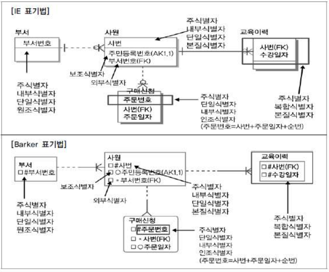
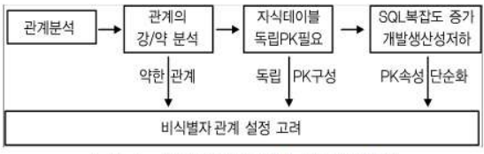

# 제5절 식별자

## 1. 식별자 (Identifiers) 개념

- 엔티티 내에서 인스턴스들을 구분할 수 있는 구분자
- 하나의 엔티티에 구성되어 있는 여러 개의 속성 중 엔티티를 대표할 수 있는 속성
- 하나의 엔티티는 반드시 하나의 유일한 식별자가 존재

## 2. 식별자의 특징

1. 유일성 : 주식별자에 의해  엔티티 내에 모든 인스턴스들을 유일하게 구분함
2. 최소성 : 주식별자를 구성하는 속성의 수는 유일성을 만족하는 최소의 수가 되어야 함
3. 불변성 : 주식별자가 한 번 특정 엔티티에 지정되면 그 식별자의 값은 변하지 않아야 함
4. 존재성 : 주식별자가 지정되면 반드시 데이터 값이 존재 (Null 불가)

## 3. 식별자 분류 및 표기법

### 1. 식별자 분류

|분류|식별자|설명|
|:---:|:---:|---|
|대표성여부|주식별자|엔티티 내에서 각 어커런스를 구분할 수 있는 구분자이며, 타 엔티티와 참조관계를 연결할 수 있는 식별자|
||보조식별자| 엔티티 내에서 각 어커런스를 구분할 수 있는 구분자이나 대표성을 가지지 못해 참조관계 연결 못함|
|스스로 생성 여부|내부식별자|엔티티 내부에서 스스로 만들어지는 식별자|
||외부식별자|타 엔티티와의 관계를 통해 타 엔티티로부터 받아오는 식별자|
|속성의 수|단일식별자|하나의 속성으로 구성된 식별자|
||복합식별자|둘 이상의 속성으로 구성된 식별자|
|대체 여부|본질식별자|업무에 의해 만들어지는 식별자|
||인조식별자|업무적으로 만들어지지는 않지만 원조식별자가 복잡한 구성을 가지고 있기 때문에 인위적으로 만든 식별자|

### 2. 식별자 표기법

## 4. 주식별자 도출기준

1. 해당 업무에서 자주 이용되는 속성을 주식별자로 지정하도록 함
2. 명칭, 내역 등과 같이 이름으로 기술되는 것은 피함
3. 속성의 수가 많아지지 않도록 함

## 5. 식별자관계와 비식별자관계에 따른 식별자

### 1. 식별자관계와 비식별자관계의 결정

- 외부식별자
    - 다른 엔티티와의 관계를 통해 자식 쪽의 엔티티에 생성되는 속성
    - Foreign Key 역할
- 자식엔티티에서 부모엔티티로부터 받은 외부식별자를 주식별자로 이용할 것인지 아니면 부모와 연결되는 속성으로만 이용할 것인지 결정해야 함

### 2. 식별자관계

- 자식엔티티의 주식별자로 부모의 주식별자가 상속되는 경우
- 자식엔티티에서 부모엔티티의 속성만 주식별자로 사용한다면 1:1 관계, 부모엔티티의 속성 외에 다른 속성과 함께 주식별자로 구성되는 경우 1:M관계

### 3. 비식별자관계

- 부모엔티티로부터 속성을 받았지만 자식엔티티의 주식별자로 사용하지 않고 일반적인 속성으로만 사용하는 경우
- 비식별자 관계에 의한 외부속성을 생성하는 경우
    1. 자식엔티티에서 받은 속성이 반드시 필수가 아니어도 무방하기 때문에 부모 없는 자식이 생성될 수 있는 경우
    2. 엔티티별로 데이터의 생명주기를 다르게 관리할 경우
    3. 여러 개의 엔티티가 하나의 엔티티로 통합되어 표현되었는데 각각의 엔티티가 별도의 관계를 가지는 경우
    4. 자식엔티티에 주식별자로 사용하여도 되지만 자식엔티티에서 별도의 주식별자를 생성하는 것이 더 유리하다고 판단되는 경우

### 4. 식별자 관계로만 설정할 경우의 문제점

식별자 관계만으로 연결된 데이터 모델의 특징은 주식별자 속성이 지속적으로 증가할 수 밖에 없는 구조라는 점인데, 이것은 개발 복잡성 및 오류 가능성을 유발시킬 수 있는 요인임

### 5. 비식별자 관계로만 설정할 경우의 문제점

비식별자 관계로만 데이터 모델링을 전개하다 보면 SQL 구분에 많은 조인이 걸리게 되고 그에 따라 복잡성이 증가하고 성능이 저하됨

### 6. 비식별자관계와 비식별자관계 모델링

1. 비식별자관계 선택 프로세스
    - 기본적으로 식별자관계로 모든 관계가 연결되면서 다음 조건에 해당할 경우 비식별자관계로 조정하면 됨

        

2. 식별자와 비식별자관계 비교

    |항목|식별자 관계|비식별자 관계|
    |:---:|---|---|
    |목적|강한 연결관계 표현|약한 연결관계 표현|
    |자식 주식별자 영향|자식 주식별자의 구성에 포함됨|자식 일반 속성에 포함됨|
    |표기법|실선|점선|
    |연결 고려사항|- 반드시 부모엔티티 종속 - 자식 주식별자 구성에 부모 주식별자 포함 필요 - 상속받은 주식별자 속성을 타 엔티티에 이전 필요|- 약한 종속관계 - 자식 주식별자 구성을 독립적으로 구성 - 자식 주식별자 구성에 부모 주식별자 부분 필요 - 상속받은 주식별자 속성을 타 엔티티에 차단 필요 - 부모쪽 관계 참여가 선택 관계|

> 본 포스팅은 SQL 개발자 가이드를 참고하여 작성되었습니다.