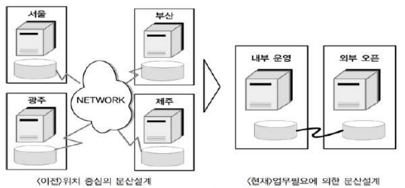
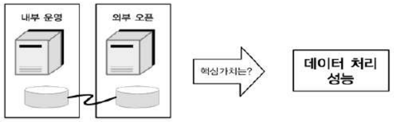
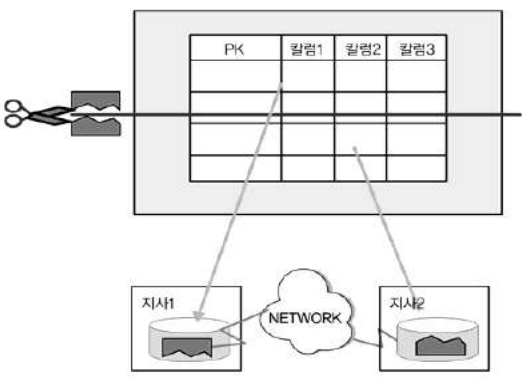
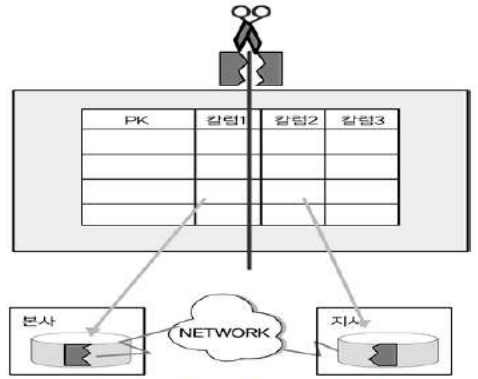
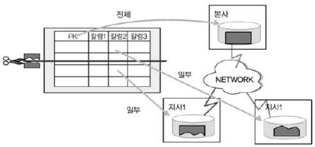
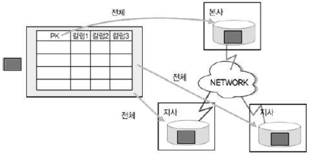
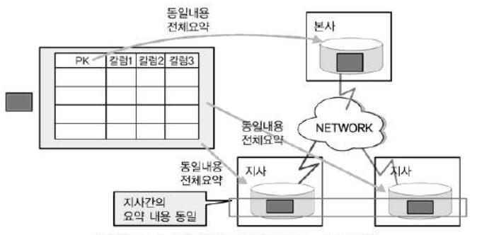
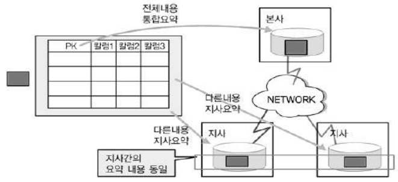

# 제6절 분산 데이터베이스와 성능

## 1. 분산 데이터베이스 정의

- 여러 곳으로 분산되어있는 데이터베이스를 하나의 가상 시스템으로 사용할 수 있도록 한 데이터베이스
- 논리적으로 동일한 시스템에 속하지만, 컴퓨터 네트워크를 통해 물리적으로 분산되어 있는 데이터들의 모임 (물리적 site 분산, 논리적 사용자 통합 및 공유)
- 데이터베이스를 연결하는 빠른 네트워크 환경을 이용하여 데이터베이스를 여러 지역 여러 노드로 위치시켜 성능, 사용성 등을 극대화시킨 데이터베이스

## 2. 분산 데이터베이스의 투명성 (Transparency)

1. 분할 투명성 (단편화) : 하나의 논리적 Realtion이 여러 단편으로 분할되어 각 단편의 사본이 여러 site에 저장
2. 위치 투명성 : 사용하려는 데이터의 저장 장소 명시 불필요. 위치 정보가 System Catalog에 유지되어야 함
3. 지역사상 투명성 : 지역 DBMS와 물리적 DB 사이의 Mapping 보장. 각 지역 시스템 이름과 무관한 이름 사용
4. 중복 투명성 : DB 객체가 여러 site에 중복되어 있는지 알 필요가 없는 성질
5. 장애 투명성 : 구성요소 (DBMS, Computer)의 장애에 무관한 Transaction의 원자성 유지
6. 병행 투명성 : 다수 Transaction 동시 수행 시 결과의 일관성 유지, Time Stamp, 분산 2단계 Locking을 이용하여 구현

## 3. 분산 데이터베이스의 적용 방법 및 장단점

### 1. 분산 데이터베이스 적용 방법

업무의 흐름을 보고 업무 구성에 따른 아키텍처 특징에 따라 데이터베이스를 구성

### 2. 분산 데이터베이스 장단점

- 장점
    1. 지역 자치성, 점증적 시스템 용량 확장
    2. 신뢰성 및 가용성
    3. 효용성 및 융통성
    4. 빠른 응답 속도와 통신 비용 절감
    5. 데이터의 가용성과 신뢰성 증가
    6. 시스템 규모의 적절한 조절
    7. 각 지역 사용자의 요구 수용 증대
- 단점
    1. 소프트웨어 개발 비용
    2. 오류의 잠재성 증대
    3. 처리 비용 증대
    4. 설계, 관리의 복잡성과 비용
    5. 불규칙한 응답 속도
    6. 통제의 어려움
    7. 데이터 무결성에 대한 위협

## 4. 분산 데이터베이스의 활용 방향성

업무적인 특징에 따라 분산데이터베이스를 활용하는 기술 필요

## 5. 데이터베이스 분산 구성의 가치

통합된 데이터베이스에서 제공할 수 없는 빠른 성능 제공

## 6. 분산 데이터베이스의 적용 기법

### 1. 테이블 위치 분산

- 설계된 테이블의 위치를 각각 다르게 위치시키는 것
- 위치별로 정보를 이용하는 형태가 다를 경우 이용
- 테이블의 구조는 변하지 않음
- 테이블이 다른 데이터베이스에 중복되어 생성되지 않음
- 테이블 위치를 파악할 수 있는 도식화된 위치별 데이터베이스 문서 필요

### 2. 테이블 분할 분산

1. 수평 분할
    - 특정 칼럼의 값을 로우(Row) 단위로 분리
    - 칼럼은 분리 X
    - 모든 데이터가 각 지사벼롤 분리되어 있는 형태
    - 데이터를 한 군데 집합시켜도 PK에 의한 중복이 발생되지 않음
    - 한 시점에 한 지사에서 하나의 데이터만 존재하므로 데이터 무결성 모장
    - 데이터 수정 시 타 지사에 있는 데이터를 원칙적으로 수정하지 않고 자신의 데이터에 대해서만 수정
    - 통합 처리 프로세스가 많은 경우 조인으로 인한 성능 저하 발생

    

    

2. 수직 분할
    - 테이블 칼럼을 기준으로 분리
    - 로우 단위 분리 X
    - 모든 데이터가 각 지사별로 분리되어 있는 형태
    - 각각의 테이블에 동일한 PK 구조와 값을 가지고 있어야 함
    - 데이터 중복은 발생되지 않음
    - 통합 처리 프로세스가 많은 경우 조인으로 인한 성능 저하 발생

    

### 3. 테이블 복제 분산

1. 부분 복제
    - 테이블의 일부 내용만 다른 지역이나 서버에 위치시킴
    - 통합된 테이블을 한 군데에 가지고 있으면서 각 지사별로 지사에 해당된 로우를 가지고 있는 형태
    - 본사의 데이터 = 지사 데이터의 합
    - 여러 테이블에 조인이 발생하지 않는 빠른 작업 수행 가능
    - 본사와 지사 간 데이터 중복이 항상 발생
    - 복사 작업은 야간에 배치 작업에 의해 수행되는 경우가 많음

    

    

2. 광역 복제
    - 테이블의 내용을 각 지역이나 서버에 존재시킴
    - 통합된 테이블을 본사에서 가지고 있으면서 각 지사에도 동일한 데이터를 모두 가지는 형태
    - 모든 지사에 있는 데이터량과 본사에 있는 데이터량 동일
    - 데이터처리에 특별한 제약을 받지 않음
    - 복사 작업은 야간에 배치 작업에 의해 수행되는 경우가 많음

    

    

### 4. 테이블 요약 분산

1. 분석 요약
    - 동일한 테이블 구조를 가지고 있으면서 분산되어 있는 동일한 내용의 데이터를 이용해 통합된 데이터를 산출하는 방식
    - 각 지사별로 존재하는 요약 정보를 본사에 통합하여 다시 전체에 대해 요약 정보를 산출하는 방법
    - 야간에 수행하여 생성

    

    

2. 통합 요약
    - 분산되어 있는 다른 내용의 데이터를 이용하여 통합된 데이터를 산출하는 방식
    - 각 지사별로 존재하는 다른 내용의 정보를 본사에 통합하여 다시 전체에 대해 요약 정보를 산출하는 방법
    - 야간에 수행하여 생성

    

    

## 7. 분산 데이터베이스를 적용하면 성능이 향상되는 경우

- 성능이 중요한 사이트
- 공통 코드, 기준 정보, 마스터데이터 등에 대해 분산 환경 구성
- 실시간 동기화가 요구되지 않을 때
- 특정 서버에 집중이 부하될 때
- 백업 사이트를 구성할 때

> 본 포스팅은 SQL 개발자 가이드를 참고하여 작성되었습니다.