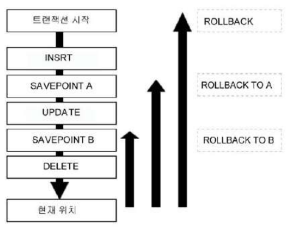

# 제4절 TCL (Transaction Control Language)

## 1. 트랜잭션 개요

- 데이터베이스의 논리적 연산 단위
- 밀접히 관련되어 분리될 수 없는 한 개 이상의 데이터베이스 조작
- 하나의 트랜잭션에는 하나 이상의 SQL 문장이 포함됨
- 분할할 수 없는 최소 단위
- 전부 적용하거 전부 취소 (ALL or NOTHING)
- 하나의 논리적인 작업 단위를 구성하는 세부적인 연산들의 집합
- 올바르게 반영된 데이터를 반영시키는 커밋 (COMMIT), 트랜잭션 시작 이전의 상태로 되돌리는 롤백 (ROLLBACK), 저장점 (SAVEPOINT) 기능
- 트랜잭션의 대상은 DML문 (UPDATE, INSERT, DELETE 등)
- 트랜잭션 특징

    |특성|설명|
    |:---:|---|
    |원자성 (Atomicity)|트랜잭션에서 정의된 연산들은 모두 성공적으로 실행되던지 아니면 전혀 실행되지 않은 상태로 남아있어야 함 (All or Nothing)|
    |일관성 (Consistency)|트랜잭션이 실행되기 전의 데이터베이스 내용이 잘못되어 있지 않다면 트랜잭션 실행 후 데이터베이스의 내용에 잘못이 있으면 안됨|
    |고립성 (Isolation)|트랜잭션이 실행되는 도중에 다른 트랜잭션의 영향을 받아 잘못된 결과를 만들어서는 안됨|
    |지속성 (Durability)|트랜잭션이 성공적으로 수행되면 그 트랜잭션이 갱신한 데이터베이스의 내용은 영구적으로 저장됨|

## 2. COMMIT

- 입력한 자료나 수정한 자료에 대해서 또는 삭제한 자료에 대해서 전혀 문제가 없다고 판단되었을 경우 COMMIT 명령어를 통해 트랜잭션 완료 가능
- COMMIT이나 ROLLBACK 전 데이터 상태
    - 다른 메모리 BUFFER에만 영향을 받았기 때문에 데이터의 변경 이전 상태로 복구 가능
    - 현재 사용자는 SELECT 문장으로 결과 확인 가능
    - 다른 사용자는 현재 사용자가 수행한 명령의 결과를 볼 수 없음
    - 변경된 행은 잠금(LOCKING)이 설정되어서 다른 사용자가 변경 불가
- COMMIT 이후 데이터 상태
    - 데이터에 대한 변경 사항이 데이터베이스에 반영됨
    - 이전 데이터는 영원히 잃어버리게 됨
    - 모든 사용자가 결과 확인 가능
    - 관련된 행에 대한 잠금(LOCKING)이 풀리고, 다른 사용자들이 행 조작 가능

### SQL Server의 COMMIT

- Oracle은 DML 실행 시 DBMS가 트랜잭션을 내부적으로 실행하며 사용자가 임의로 COMMIT 또는 ROLLBACK을 수행해야 트랜잭션이 종료됨 (일부 툴에서는 AUTO COMMIT 옵션 선택 가능)
- SQL Server는 기본적으로 AUTO COMMIT 모드이므로 COMMIT이나 ROLLBACK 처리 필요 X
- SQL Server는 DML 구문이 성공이면 자동으로 COMMIT하고 오류가 발생하면 자동으로 ROLLBACK 처리
- SQL Server에서의 트랜잭션 방식
    1. AUTO COMMIT
        - SQL Server의 기본 방식
        - DBMS가 트랜잭션을 컨트롤
        - 명령어 성공적 수행 시 자동 COMMIT, 오류 발생 시 자동 ROLLBACK
    2. 암시적 트랜잭션
        - Oracle과 같은 방식으로 처리
        - 트랜잭션 시작은 DBMS가 처리하고 트랜잭션 끝은 사용자가 명시적으로 COMMIT 또는 ROLLBACK 처리
        - 인스턴스 단위 설정 시 암시적 트랜잭션 체크
        - 세션 단위 설정 시 SET IMPLICIT TRANSACTION ON 사용
    3. 명시적 트랜잭션
        - 트랜잭션의 시작과 끝을 모두 사용자가 명시적으로 지정하는 방식
        - BEGIN TRANSACTION 으로 시작하고 (BEGIN TRAN 구문도 가능) 
        COMMIT TRANSACTION 또는 ROLLBACK TRANSACTION으로 트랜잭션 종료 (TRANSACTION 생략 가능)
        - ROLLBACK 구문을 만나면 최초의 BEGIN TARNSACTION 시점까지 모두 ROLLBACK 수행

## 3. ROLLBACK

- 데이터 변경 사항이 취소되어 데이터를 이전 상태로 복구하며, 관련된 행에 대한 잠금(LOCKING)이 풀리고 다른 사용자들이 데이터 변경을 할 수 있음
- ROLLBACK 이후 데이터 상태
    - 데이터에 대한 변경 사항 취소
    - 이전 데이터는 다시 재저장
    - 관련 행에 대한 잠금(LOCKING)이 풀리고, 다른 사용자들이 행 조작 가능
- COMMIT과 ROLLBACK을 사용함으로써 얻을 수 있는 효과
    - 데이터 무결성 보장
    - 영구적인 변경 전 데이터 변경 사항 확인 가능
    - 논리적으로 연관된 작업 그룹핑 처리 가능
- SQL Server의 ROLLBACK
    - 임의적으로 ROLLBACK 을 수행하기 위해 명시적으로 트랜잭션 선언 필요

## 4. SAVEPOINT

- 현 시점에서 저장점(SAVEPOINT)까지 트랜잭션의 일부만 ROLLBACK (일부 툴에서는 지원 X)
- 동일 이름으로 저장점을 정의했을 때 나중에 정의한 저장점이 유효함
- 저장점까지 롤백할 때 ROLLBACK 뒤에 저장점명 지정

    ```sql
    ROLLBACK TO 저장점명;
    ```

- SQL Server는 SAVE TRASACTION을 사용하여 동일한 기능 수행

    ```sql
    SAVE TRANSACTION 저장점명;
    ```

- 저장점과 관련한 ROLLBACK 원리

    

    - "ROLLBACK TO A"를 실행한 시점에서 저장점 A 이후에 정의한 저장점 B는 존재 X
    - 저장점 없이 "ROLLBACK"을 실행했을 경우 반영 안된 모든 변경 사항을 취소하고 트랜잭션 시작 위치로 되돌아감

## 5. 트랜잭션 정리

- 테이블에 데이터 변경을 발생시키는 입력 (INSERT), 수정 (UPDATE), 삭제 (DELETE) 수행 시 그 변경되는 데이터의 무결성을 보장하는 것이 커밋 (COMMIT)과 롤백 (ROLLBACK)의 목적
- 커밋 (COMMIT) : 변경된 데이터를 테이블에 영구적으로 반영
- 롤백 (ROLLBACK) : 특정 지점으로 복귀
- 저장점 (SAVEPOINT / SAVE TRANSACTION) : 데이터 변경을 사전에 지정한 저장점까지만 롤백
- DDL  문장 (CREATE, ALTER, DROP, RENAME, TRUNCATE TABLE)을 실행하면 그 전후 시점에 자동으로 커밋
- DML 문장 이후 커밋 없이 DDL 문장이 실행되면 DDL 수행 전에 자동으로 커밋
- 데이터베이스를 정상적으로 접속 종료하면 자동으로 트랜잭션 커밋
- 애플리케이션의 이상 종료로 데이터베이스와의 접속이 단절된 경우 트랜잭션 자동 롤백

> 본 포스팅은 SQL 개발자 가이드를 참고하여 작성되었습니다.