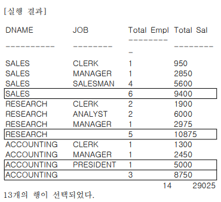
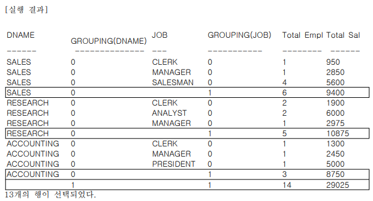
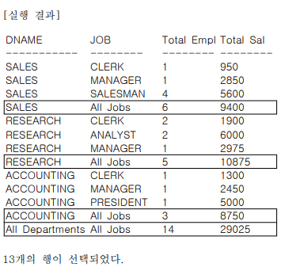
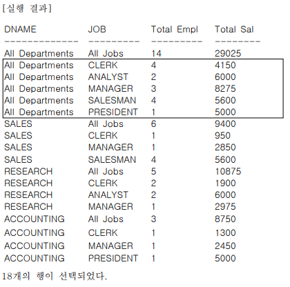
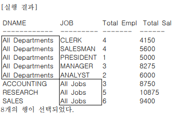

# 제5절 그룹 함수

## 1. 데이터 분석 개요

- ANSI/ISO SQL 표준은 데이터 분석을 위해 다음 세가지 함수 정의
    - AGGREGATE FUNCTION
    - GROUP FUNCTION
    - WINDOW FUNCTION

### 1. AGGREGATE FUNCTION

- GROUP AGGREGATE FUNCTION 이라고도 부름
- COUNT, SUM, AVG, MAX, MIN 외 각종 집계 함수

### 2. GROUP FUNCTION

- ROLLUP 함수
    - 소그룹 간의 소계 계산
    - GROUP BY의 확장된 형태
    - 병렬로 수행 가능
    - 계층적 분류를 포함하고 있는 데이터의 집계에 적합
- CUBE 함수
    - GROUP BY 항목들 간 다차원적인 소계를 계산 가능
    - 장점 : 다양한 데이터를 얻을 수 있음
    - 단점 : 시스템에 부하를 많이 줌
- GROUPING SETS
    - 특정 항목에 대한 소계 계산
- 정렬이 필요한 경우 ORDER BY 절에 정렬 칼럼을 명시해야 함

### 3. WINDOW FUNCTION

- 분석 함수 (ANALYTIC FUNCTION), 순위 함수 (RANK FUNCTION) 이라고도 알려짐
- 데이터웨어하우스에서 발전한 기능

## 2. ROLLUP 함수

- ROLLUP 함수에 지정된 Grouping Columns의 List는 Subtotal을 생성하기 위해 사용됨
- Grouping Columns의 수를 N이라 했을 때 N+1 Level의 Subtotal이 생성 됨
- ROLLUP의 인수는 계층 구조
- 인수 순서가 바뀌면 수행 결과도 바뀜
- [예제] 부서명과 업무명을 기준으로 집계한 일반적인 GROUP BY SQL 문장에 ROLLUP 함수 사용

    ```sql
    SELECT DNAME, JOB, COUNT(*) "Total Empl", SUM(SAL) "Total Sal"
    FROM EMP, DEPT
    WHERE DEPT.DEPTNO = EMP.DEPTNO
    GROUP BY ROLLUP (DNAME, JOB);
    ```

    

- GROUPING 함수 사용
    - ROLLUP, CUBE, GROUPING SETS 등 새로운 그룹 함수를 지원하기 위한 함수
    - ROLLUP이나 CUBE에 의한 소계가 계산된 결과에는 GROUPING(EXPR) = 1 이 표시되고, 그 외의 결과에는 0이 표시됨

    ```sql
    SELECT DNAME,GROUPING(DNAME), JOB, GROUPING(JOB),
           COUNT(*) "Total Empl", SUM(SAL) "Total Sal"
    FROM EMP, DEPT
    WHERE DEPT.DEPTNO = EMP.DEPTNO
    GROUP BY ROLLUP (DNAME, JOB);
    ```

    

- GROUPING + CASE

    ```sql
    SELECT CASE GROUPING(DNAME) WHEN 1 THEN 'All Departments'
           ELSE DNAME END AS DNAME,
           CASE GROUPING(JOB) WHEN 1 THEN 'All Jobs'
           ELSE JOB END AS JOB,
           COUNT(*) "Total Empl", SUM(SAL) "Total Sal"
    FROM EMP, DEPT
    WHERE DEPT.DEPTNO = EMP.DEPTNO
    GROUP BY ROLLUP (DNAME, JOB);
    ```

    Oracle의 경우 DECODE를 사용해서 좀 더 짧게 표현 가능

    ```sql
    SELECT DECODE(GROUPING(DNAME), 1, 'All Departments', DNAME) AS DNAME,
           DECODE(GROUPING(JOB), 1, 'All Jobs', JOB) AS JOB,
           COUNT(*) "Total Empl", SUM(SAL) "Total Sal"
    FROM EMP, DEPT
    WHERE DEPT.DEPTNO = EMP.DEPTNO
    GROUP BY ROLLUP (DNAME, JOB);
    ```

    

## 3. CUBE 함수

- 결합 가능한 모든 값에 대하여 다차원 집계 생성
- ROLLUP에 비해 시스템의 연산 대상이 많음
- 모든 경우에 대하여 Subtotal을 생성해야 하는 경우 바람직
- 표시된 인수들에 대한 계층별 집계 구할 수 있음
- ROLLUP과 달리 평등한 관계이므로 인수의 순서가 바뀌어도 데이터 결과는 같음

```sql
SELECT CASE GROUPING(DNAME) WHEN 1 THEN 'All Departments'
       ELSE DNAME END AS DNAME,
       CASE GROUPING(JOB) WHEN 1 THEN 'All Jobs'
       ELSE JOB END AS JOB,
       COUNT(*) "Total Empl", SUM(SAL) "Total Sal"
FROM EMP, DEPT
WHERE DEPT.DEPTNO = EMP.DEPTNO
GROUP BY CUBE (DNAME, JOB);
```



- UNION ALL 사용 SQL
    - CUBE SQL과 결과 데이터는 같으나 행들의 정렬은 다를 수 있음

    ```sql
    SELECT DNAME, JOB, COUNT(*) "Total Empl", SUM(SAL) "Total Sal"
    FROM EMP, DEPT
    WHERE DEPT.DEPTNO = EMP.DEPTNO
    GROUP BY DNAME, JOB
    UNION ALL
    SELECT DNAME, 'All Jobs', COUNT(*) "Total Empl", SUM(SAL) "Total Sal"
    FROM EMP, DEPT
    WHERE DEPT.DEPTNO = EMP.DEPTNO
    GROUP BY DNAME
    UNION ALL
    SELECT 'All Departments', JOB, COUNT(*) "Total Empl", SUM(SAL) "Total Sal"
    FROM EMP, DEPT
    WHERE DEPT.DEPTNO = EMP.DEPTNO
    GROUP BY JOB
    UNION ALL
    SELECT 'All Departments', 'All Jobs', COUNT(*) "Total Empl", SUM(SAL) "Total Sal"
    FROM EMP, DEPT
    WHERE DEPT.DEPTNO = EMP.DEPTNO ;
    ```

- CUBE를 사용하며 테이블에 반복적으로 액세스하는 부분을 한 번으로 줄일 수 있음 ⇒ 수행 속도 및 자원 사용율 개선, 가독성 증가

## 4. GROUPING SETS 함수

- GROUP BY SQL 문장을 여러 번 반복하지 않아도 원하는 결과를 쉽게 얻을 수 있음
- 표시된 인수들에 대한 개별 집계를 구할 수 있음
- 평등한 관계이므로 인수의 순서가 바뀌어도 결과가 같음
- 일반 함수를 이용한 SQL

    ```sql
    SELECT DNAME, 'All Jobs' JOB, COUNT(*) "Total Empl", SUM(SAL) "Total Sal"
    FROM EMP, DEPT
    WHERE DEPT.DEPTNO = EMP.DEPTNO
    GROUP BY DNAME
    UNION ALL
    SELECT 'All Departments' DNAME, JOB, COUNT(*) "Total Empl",
    SUM(SAL) "Total Sal"
    FROM EMP, DEPT
    WHERE DEPT.DEPTNO = EMP.DEPTNO
    GROUP BY JOB ;
    ```

- GROUPING SETS 사용한 SQL

    ```sql
    SELECT DECODE(GROUPING(DNAME), 1, 'All Departments', DNAME) AS DNAME,
    DECODE(GROUPING(JOB), 1, 'All Jobs', JOB) AS JOB,
    COUNT(*) "Total Empl",
    SUM(SAL) "Total Sal"
    FROM EMP, DEPT
    WHERE DEPT.DEPTNO = EMP.DEPTNO
    GROUP BY GROUPING SETS (DNAME, JOB);
    ```

- 두 SQL은 같은 결과를 보여줌 (행들의 정렬 순서가 다를 수도 있음(

    

        
> 본 포스팅은 SQL 개발자 가이드를 참고하여 작성되었습니다.