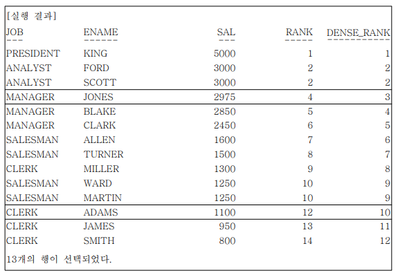
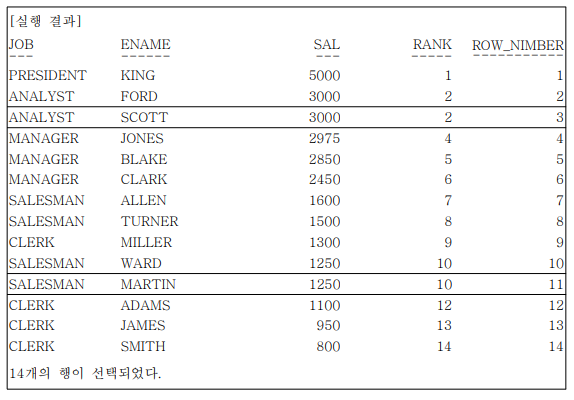
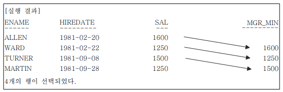
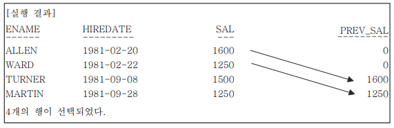
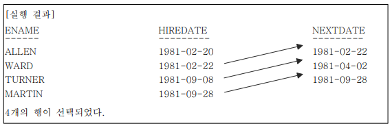
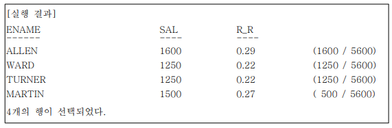
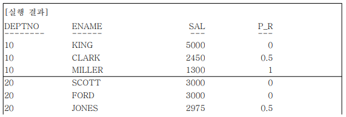
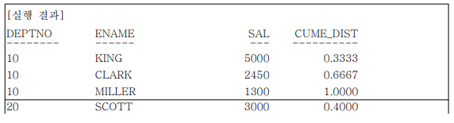

# 제6절 윈도우 함수

## 1. WINDOW FUNCTION 개요

- 분석 함수 (ALALYTIC FUNCTION) 또는 순위 함수 (RANK FUNCTION) 라고도 알려짐
- 데이터웨어하우스에서 발전한 기능

### 1. WINDOW FUNCTION 종류

- 그룹 내 순위 (RANK) 관련 함수 : RANK, DENSE_RANK, ROW_NUMBER
- 그룹 내 집계 (AGGREGATE) 관련 함수 : SUM, MAX, MIN, AVG, COUNT
- 그룹 내 행 순서 관련 함수 : FIRST_VALUE, LAST_VALUE, LAG, LEAD (Oracle에서만 지원)
- 그룹 내 비율 관련 함수 : CUME_DIST, PERCENT_RANK, NTILE (Oracle, SQL Server에서만 지원), RATIO_TO_REPORT (Oracle에서만 지원)
- 선형 분석 포함한 통계 분석 관련 함수가 있는데 통계 특화 기능이므로 생략

### 2. WINDOW FUNCTION SYNTAX

```sql
SELECT WINDOW_FUNCTION (ARGUMENTS) OVER
( [PARTITION BY 칼럼] [ORDER BY 절] [WINDOWING 절] )
FROM 테이블명;
```

- WINDOW_FUNCTION : 기존에 사용하던 함수도 있고, 새롭게 WINDOW 함수용으로 추가된 함수도 있음
- ARGUMENTS (인수) : 함수에 따라 0 ~ N개 인수가 지정될 수 있음
- PARTITION BY 절 : 전체 집합을 기준에 의해 소그룹으로 나눌 수 있음
- ORDER BY 절 : 어떤 항목에 대해 순위를 지정할지 기술
- WINDOWING 절 :
    - 함수의 대상이 되는 행 기준의 범위를 강력하게 지정 가능.
    - ROWS는 물리적인 결과 행의 수, RANGE는 논리적인 값에 의한 범위
    - SQL Server에서 지원X

## 2. 그룹 내 순위 함수

### 1. RANK 함수

- ORDER BY를 포함한 QUERY 문에서 특정 항목 (칼럼)에 대한 순위를 구하는 함수
- 특정 범위 (PARTITION) 내에서 순위
- 전체 데이터에 대한 순위
- 동일한 값에 대한 동일 순위 부여

```sql
SELECT JOB, ENAME, SAL,
       RANK() OVER (ORDER BY SAL DESC) ALL_RANK,
       RANK() OVER (PARTITION BY JOB ORDER BY SAL DESC) JOB_RANK
FROM EMP;
```

### 2. DENSE_RANK 함수

- RANK와 거의 유사하나, 동일한 순위를 하나의 건수로 취급하는 점이 다름

    RANK의 경우 : 1 2 2 4

    DENSE_RANK의 경우 : 1 2 2 3

```sql
SELECT JOB, ENAME, SAL,
       RANK() OVER (ORDER BY SAL DESC) RANK,
       DENSE_RANK() OVER (ORDER BY SAL DESC) DENSE_RANK
FROM EMP;
```



### 3. ROW_NUMBER 함수

- 동일한 값이라도 고유한 순위 부여

```sql
SELECT JOB, ENAME, SAL,
       RANK() OVER (ORDER BY SAL DESC) RANK,
       ROW_NUMBER() OVER (ORDER BY SAL DESC) ROW_NUMBER
FROM EMP;
```




## 3. 일반 집계 함수

### 1. SUM 함수

- 파티션별 윈도우 합을 구할 수 있음
- [예제] 사원들의 급여와 같은 매니저를 두고 있는 사원들의 SALARY 합 구하기

    ```sql
    SELECT MGR, ENAME, SAL, SUM(SAL) OVER (PARTITION BY MGR) MGR_SUM
    FROM EMP;
    ```

### 2. MAX 함수

- 파티션별 윈도우의 최대값을 구할 수 있음
- [예제] 사원들의 급여와 같은 매니저를 두고 있는 사원들의 SALARY 중 최대값 구하기

    ```sql
    SELECT MGR, ENAME, SAL, MAX(SAL) OVER (PARTITION BY MGR) as MGR_MAX
    FROM EMP;
    ```

### 3. MIN 함수

- 파티션별 윈도우의 최소값을 구할 수 있음
- [예제] 사원들의 급여와 같은 매니저를 두고 있는 사원들을 입사일자 기준으로 정렬하고, SALARY 최소값 구하기

    ```sql
    SELECT MGR, ENAME, HIREDATE, SAL, 
           MIN(SAL) OVER (PARTITION BY MGR ORDER BY HIREDATE) as MGR_MIN
    FROM EMP;
    ```

### 4. AVG 함수

- AVG 함수와 파티션별 ROWS 윈도우를 이용해 원하는 조건에 맞는 데이터에 대한 통계값을 구할 수 있음 ⇒ 평균
- [예제] EMP 테이블에서 같은 매니저를 두고 있는 사원들의 평균 SALARY를 구하는데, 조건은 같은 매니저 내에서 자기 바로 앞의 사번과 ㄷ바로 뒤의 사번인 직원만을 대상으로 함

    ```sql
    SELECT MGR, ENAME, HIREDATE, SAL,
           ROUND (AVG(SAL) OVER (PARTITION BY MGR ORDER BY HIREDATE
                  ROWS DETWEEN 1 PRECEDING AND 1 FOLLOWING)) as MGR_AVG
    FROM EMP;
    ```

### 5. COUNT 함수

- 조건에 맞는 데이터에 대한 통계 값을 구할 수 있음 ⇒ 횟수 세기
- [예제] 사원들을 급여 기준으로 정렬하고, 본인의 급여보다 50 이하 적거나 150 이하로 많은 급여를 받는 인원 수 출력

    ```sql
    SELECT ENAME, SAL, COUNT(*) OVER (ORDER BY SAL
           RANGE BETWEEN 50 PRECEDING AND 150 FOLLOWING) as SIM_CNT
    FROM EMP;
    ```

## 4. 글부 내 행 순서 함수

### 1. FIRST_VALUE 함수

- 파티션별 윈도우에서 가장 먼저 나온 값을 구함
- SQL Server에서 지원하지 않는 함수
- MAX나 MIN 함수를 활용하여 같은 결과를 얻을 수도 있음
- [예제]부서별 직원들을 연봉이 높은 순서부터 정렬하고, 파티션 내에서 가장 먼저 나온 값 출력 (가장 연봉이 많은 직원 출력)

    ```sql
    SELECT DEPTNO, ENAME, SAL, FIRST_VALUE(ENAME)
           OVER (PARTITION BY DEPTNO ORDER BY SAL DESC
           ROWS UNBOUNDED PRECEDING) as DEPT_RICH
    FROM EMP;
    ```

### 2. LAST_VALUE 함수

- 파티션별 윈도우에서 가장 나중에 나온 값을 구함
- SQL Server에서는 지원하지 않는 함수
- MAX나 MIN 함수를 활용하여 같은 결과를 얻을 수도 있음
- [예제] 부서별 직원들을 연봉이 높은 순서부터 정렬하고, 파티션 내에서 가장 마지막에 나온 값 출력 (가장 연봉이 적은 직원 출력)

    ```sql
    SELECT DEPTNO, ENAME, SAL, LAST_VALUE(ENAME)
           OVER (PARTITION BY DEPTNO ORDER BY SAL DESC
           ROWS UNBOUNDED PRECEDING) as DEPT_RICH
    FROM EMP;
    ```

### 3. LAG 함수

- 파티션별 윈도우에서 이전 몇 번째 행의 값을 가져올 수 있은
- SQL Server에서는 지원하지 않는 함수
- [예제] 직원들을 입사 일자가 빠른 기준으로 정렬하고, 본인보다 입사일자가 한 명 앞선 사원의 급여를 본인의 급여와 함께 출력

    ```sql
    SELECT ENAME, HIREDATE, SAL,
           LAG(SAL) OVER (ORDER BY HIREDATE) as PREV_SAL
    FROM EMP
    WHERE JOB = 'SALESMAN';
    ```

    

- LAG 함수는 3개의 ARGUMENTS까지 사용 가능
    - 두 번째 인자 : 몇 번째 앞의 행을 가져올지 결정 (DEFAULT 1)
    - 세 번째 인자 : 파티션의 첫 번째 행의 경우 가져올 데이터가 없어 NULL 값이 들어오는데 이 경우 다른 값으로 바꾸어 줄 수 있음
    - [예제] 직원들의 입사 일자가 빠른 기준으로 정렬하고, 본인보다 입사일자가 두 명 앞선 사원의 급여를 본인의 급여와 함께 출력. 데이터가 없는 경우 0으로 변경

    ```sql
    SELECT ENAME, HIREDATE, SAL,
           LAG(SAL, 2, 0) OVER (ORDER BY HIREDATE) as PREV_SAL
    FROM EMP
    WHERE JOB = 'SALESMAN';
    ```

    

### 4. LEAD 함수

- 파티션별 윈도우에서 이후 몇 번째 행의 값을 가져올 수 있음
- SQL Server에서는 미지원 함수
- LAG와 반대
- [예제] 직원들을 입사일자가 빠른 기준으로 정렬하고, 바로 다음에 입사한 인력의 입사일자를 함께 출력

    ```sql
    SELECT ENAME, HIREDATE,
           LEAD (HIREDATE, 1) OVER (ORDER BY HIREDATE) as "NEXTHIRED"
    FROM EMP;
    ```

    

## 5. 그룹 내 비율 함수

### 1. RATIO_TO_REPORT 함수

- 파티션 내 전체 SUM값에 대한 행별 칼럼 값의 백분율을 소수점으로 구할 수 있음
- 결과 값은 범위 : `> 0 & <= 1`
- 개별 RATIO 합을 구하면 1이 됨
- SQL Server 미지원
- [예제] JOB이 SALESMAN인 사원들을 대상으로 전체 급여에서 본인이 차지하는 비율 출력

    ```sql
    SELECT ENAME, SAL, ROUND(RATIO_TO_REPORT(SAL) OVER(), 2) as R_R
    FROM EMP
    WHERE JOB = 'SALESMAN';
    ```

    

### 2. PERCENT_RANK 함수

- 파티션별 윈도우에서 제일 먼저 나오는 것을 0, 제일 늦게 나오는 것을 1로 하여 행의 순서별 백분율을 구함
- 결과 값 범위 : `>= 0 & <= 1`
- SQL Server 미지원
- [예제] 같은 부서 소속 사원들의 집합에서 본인의 급여가 순서상 몇 번째 위치쯤에 있는지 0과 1사이의 값으로 출력

    ```sql
    SELECT DEPTNO, ENAME, SAL,
           PERCENT_RANK() OVER (PARTITION BY DEPTNO ORDER BY SAL DESC) as P_R
    FROM EMP;
    ```

    

### 3. CUME_DIST 함수

- 파팁션별 윈도우의 전체 건수에서 현재 행보다 작거나 같은 건수에 대한 누적백분율을 구함
- 결과 값 범위 : `> 0 & <= 1`
- SQL Server 미지원
- [예제] 같은 부서 소속 사원들의 집합에서 본인의 급여가 누적 순서상 몇 번째 위치쯤에 있는지 0과 1 사이의 값으로 출력

    ```sql
    SELECT DEPTNO, ENAME, SAL,
           CUME_DIST() OVER (PARTITION BY DEPTNO ORDER BY SAL DESC) as CUME_DIST
    FROM EMP;
    ```

    

### 4. NTILE 함수

- 파티션별 전체 건수를 ARGUMENT 값으로 N 등분한 결과를 구할 수 있음
- [예제] 전체 사원을 급여가 높은 순서로 정렬하고, 급여를 기준으로 4개의 그룹으로 분류

    ```sql
    SELECT ENAME, SAL, NTILE(4) OVER (ORDER BY SAL DESC) as QUAR_TITME
    FROM EMP;
    ```

    ```sql
    [실행결과]
    DEPTNO   ENAME     SAL   QUAR_TILE
    -------- ------    ---   ----------
    10       KING      5000      1
    10       FORD      3000      1
    10       SCOTT     3000      1
    20       JONES     2975      1

    20       BLAKE     2850      2
    20       CLARK     2450      2
    20       ALLEN     1600      2
    20       TURNER    1500      2

    30       MILLER    1300      3
    30       WARD      1250      3
    30       MARTIN    1250      3

    30       ADAMS     1100      4
    30       JAMES     950       4
    30       SMITH     800       4
    ```

    4개의 그룹으로 나눴으므로 4명 + 4명 + 3명 + 3명으로 조를 나눔

            
> 본 포스팅은 SQL 개발자 가이드를 참고하여 작성되었습니다.