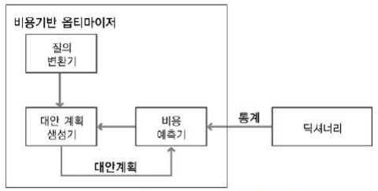
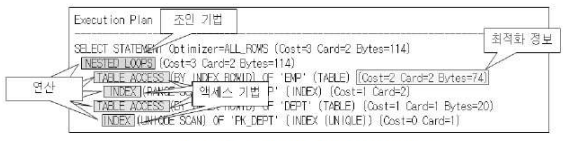

# 제1절 옵티마이저와 실행 계획

## 1. 옵티마이저 (Optimizer)

- 사용자가 질의한 SQL 문에 대해 최적의 실행 방법(실행 계획)을 결정하는 역할 수행
- 선택한 실행 방법의 적절성 여부는 질의 수행 속도에 가장 큰 영향을 미침

### 1. 규칙 기반 옵티마이저 (RBO, Rule Based Optimizer)

- 규칙(우선 순위)을 가지고 실행 계획 생성
- 규칙기반 옵티마이저가 실행 계획을 생성할 때 참조하는 정보
    - SQL문을 실행하기 위해 이용 가능한 인덱스 유무와 종류(유일, 비유일, 단일, 복합 인덱스)
    - SQL문에서 사용하는 연산자 (=, <, <>, LIKE, BETWEEN 등)
    - SQL문에서 참조하는 객체 종류 (힙 테이블, 클러스터 테이블 등)
- 규칙기반 옵티마이저의 규칙

    |순위|액세스기법|
    |:--:|---|
    |1|Single row by rowid|
    |2|Single row by cluster join|
    |3|Single row by hash cluster key with unique or primary key|
    |4|Single row by unique or primary key|
    |5|Cluster join|
    |6|Hash cluster ey|
    |7|Indexed cluster key|
    |8|Composite index|
    |9|Single column index|
    |10|Bounded range search on indexed columns|
    |11|Unbounded range search on indexed columns|
    |12|Sort merge join|
    |13|MAX or MIN of indexed column|
    |14|ORDER BY on indexed column|
    |15|Full table scan|

    주요 규칙에 대해서만 간략히 설명

    규칙 1. Single row by rowid

    - ROWID를 통해서 테이블에 하나의 행을 액세스하는 방식
    - 다른 정보를 참조하지 않고도 바로 원하는 행 액세스 가능
    - 하나의 행을 액세스하는 가장 빠른 방법

    규칙 4. Single row by unique or primary key

    - 유일 인덱스 (Unique Index)를 통해 하나의 행을 액세스하는 방식

    규칙 8. Composite index

    - 동등('=' 연산자) 조건으로 검색하는 경우

    규칙 9. Single column index

    - 단일 칼럼 인덱스에 '=' 조건으로 검색하는 경우

    규칙 10. Bounded range search on indexed columns

    - 양쪽 범위를 한정하는 형태로 검색하는 방식

    규칙 11. Unbounded range search on indexed columns

    - 한쪽 범위만 한정하는 형태로 검색하는 방식

    규칙 15. Full table scan

    - 전체 테이블을 액세스하면서 조건절에 주어진 조건을 만족하는 행만을 결과로 추출
- 규칙 기반 옵티마이저가 생성한 실행 계획

    ```sql
    SELECT STATEMENT Optimaizer=CHOOSE
    TABLE ACCESS (BY INDEX ROWID) OF 'EMP'
    INDEX (RANGE SCAN) OF 'EMP_JOB' (NON-UNIQUE)
    ```

### 2. 비용 기반 옵티마이저 (CBO, Cost Based Optimizer)

- 규칙 기반 옵티마이저의 단점 극복을 위해 출현
- SQL문을 처리하는데 필요한 비용이 가장 적은 실행계획을 처리하는 방식
    - 비용 : SQL문을 처리하기 위해 예상되는 소요시간 또는 자원 사용량
- 비용기반 옵티마이저 구성 요소

    

    - 질의 변환기 :
        - 사용자가 작성한 SQL문을 처리하기 좋은 형태로 변환하는 모듈
    - 대안 계획 생성기 :
        - 동일한 결과를 생성하는 다양한 대안 계획을 생성하는 모듈
        - 생성이 너무 많아지면 최적화를 수행하는 시간이 오래 걸릴 수 있음
    - 비용 예측기 ;
        - 대안 계획 생성기에 의해서 생성된 대안 계획의 비용을 예측하는 모듈
- 비용기반 옵티마이저는 통계 정보, DBMS 버전, DBMS 설정 정보 등의 차이로 인해 동일 SQL 문도 서로 다른 실행 계획이 생성될 수 있음
- 다양한 한계들로 인해 실행계획의 예측 및 제어가 어렵다는 단점이 있음

## 2. 실행계획

- SQL에서 요구한 사항을 처리하기 위한 절차와 방법
- 생성된 실행계획을 보는 방법은 데이터베이스 벤더마다 다름
- 실행계획 구성 요소

    

    - 조인 기법  : 두 개의 테이블을 조인할 때 사용할 수 있는 방법
    (NL Join, Hash Join, Sort Merge Join 등)
    - 액세스 기법 : 하나의 테이블을 액세스할 때 사용할 수 있는 방법
    (인덱스 스캔, 전체 테이블 스캔 등)
    - 최적화 정보 : 옵티마이저가 실행계획의 각 단계마다 예상되는 비용 사항을 표시한 것
        - Cost : 상대적인 비용 정보
        - Card : 주어진 조건을 만족한 결과 집합 혹은 조인 조건을 만족한 결과 집합 건수
        - Bytes : 결과 집합이 차지하는 메모리 양을 바이트로 표시한 것
    - 연산 : 여러 가지 조작을 통해서 원하는 결과를 얻어내는 인련의 작업

## 3. SQL 처리 흐름도

- SQL의 내부적인 처리 절차를 시각적으로 표현한 도표
- 실행계획을 시각화한 것

> 본 포스팅은 SQL 개발자 가이드를 참고하여 작성되었습니다.