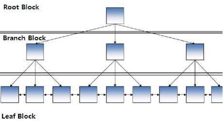

# 제2절 인덱스 기본

## 1. 인덱스 특징과 종류

- 원하는 데이터를 쉽게 찾을 수 있도록 돕는 책의 찾아보기와 유사한 개념
- 테이블 기반으로 선택적으로 생성할 수 있는 구조
- 인덱스의 목적 : 검색 성능 최적화
- 단점 : DML 작업은 테이블과 인덱스를 함께 변경해야 하기 때문에 오히려 느려질 수 있음

### 1. 트리 기반 인덱스

- 가장 일반적인 인덱스는 B-트리 인덱스

- 루트 블록 (Root Block)
    - 가장 상위에 위치한 블록
- 브랜치 블록 (Branch Block)
    - 분기를 목적으로 하는 블록
- 리프 블록 (Leaf Block)
    - 가장 하위에 위치한 블록
    - 인덱스를 구성하는 `칼럼의 데이터`와 해당 데이터를 가지고 잇는 행의 위치를 가리키는 `레코드 식별자(RID, Record Identifier / Rowid)` 로 구성
    - 인덱스 데이터 : 인덱스를 구성하는 칼럼의 값으로 정렬됨
    - 인덱스 값이 동일하면 레코드 식별자 순으로 저장됨
    - 양방향 링크를 가짐 ⇒ 오름차순, 내림차순 검색을 쉽게 할 수 있음
- B-트리 인덱스는 '='로 검색하는 `일치 검색`과 'BETWEEN', '>' 등과 같은 연산자로 검색하는 `범위 검색` 모두 적합한 구조
- 인덱스에서 원하는 값을 찾는과정
    1. 브랜치 블록의 가장 왼쪽 값이 찾고자 하는 값보다 작거나 같으면 왼쪽 포인터로 이동
    2. 찾고자 하는 값이브랜치 블록의값 사이에 존재하면 가운데 포인터로 이동
    3. 오른쪽에 있는 값보다크면 오른쪽 포인터로 이동
- Oracle에서 트리 기반 인덱슨에는 B-트리 인덱스 외에도 비트맵 인덱스, 리버스 키 인덱스,함수기반 인덱스 등이 존재함

### 2. SQL Server의 클러스터형 인덱스

- 인덱스의 리프 페이지가 곧 데이터 페이지
- 리프 페이지의 모든 로우(=데이터)는 인덱스 키 칼럼 순으로 물리적으로 정렬되어 저장됨

## 2. 전체 테이블 스캔과 인덱스 스캔

### 1. 전체 테이블 스캔

- 테이블에존재하는 모든데이터를 읽어가면서 조건에 맞으면 결과로서 추출하고조건에맞지 않으면 버리는 방식으로 검색
- 모든 결과를 찾을 때까지 시간이 오래 걸릴 수있음
- 옵티마이저가 전체 테이블스캔 방식을 선택하는 이유
    1. SQL문에 조건이 존재하지 않을 경우
        - 모든 데이터가 답이 되므로 모든 블록을 읽으며 무조건 결과 반환
    2. SQL문의 주어진 조건에 사용 가능한 인덱스가 존재하지 않는 경우
        - 사용 가능한 인덱스가 존재하지 않으면 테이블의 모든 데이터를 읽으면서 검사하는 방법 밖에 없음
        - 주어진 조건에 사용 가능한 인덱스는 존재하나 함수를 사용하여 인덱스 칼럼을 변형한 경우에도 인덱스 사용 불가
    3. 옵티마이저의 취사 선택
        - 조건을 만족하는 데이터가 많은 경우
    4. 그 밖의 경우
        - 병렬처리 방식으로 처리하는 경우
        - 전체 테이블 스캔 방식의 힌트를 사용한 경우

### 2. 인덱스 스캔

- 인덱스를 구성하는 칼럼의 값을 기반으로 데이터를 추출하는 액세스 기법
- 인덱스의 리프 블록은 인덱스를 구성하는 칼럼과 레코드 식별자로 구성됨
- 인덱스는 인덱스 구성 칼럼순으로 정렬되어 있음
- 자주 사용되는 스캔
    1. 인덱스 유일 스캔 (Index Unique Scan)
        - 단 하나의 데이터를 추출하는 방식
        - 중복 허락 X
    2. 인덱스 범위 스캔 (Index Range Scan)
        - 인덱스를 이용하여 한 건 이상의 데이터를 추출하는 방식
    3. 인덱스 역순 범위 스캔 (Index Range Scan Descending)
        - 인덱스의 리프 블록의 양방향 링크를 이용해 내림차순으로 데이터를 읽는 방법
        - 최대값을 쉽게 찾을 수 있음
- 이 외에도 인덱스 전체 스캔, 인덱스 고속 전체 스캔, 인덱스 스킵 스캔 등이 존재함

### 3. 전체 테이블 스캔과 인덱스 스캔 방식 비교

|인덱스 스캔 방식|전체 테이블 스캔 방식|
|---|---|
|인덱스를 경유해서 읽음|테이블 전체 데이터를 모두 읽으면서 데이터 추출|
|사용 가능한 적절한 인덱스가 존재할 때만 이용 가능|인덱스의 존재 유무와 상관없이 항상 사용 가능|
|한 번의 I/O 요청에 한 블록씩 데이터를 읽음|한 번의 I/O 요청으로 여러 블록을 한꺼번에 읽음|
|극히 일부의 데이터를 찾을 때 효율적|모든 데이터를 읽을 때 효율적|

 

> 본 포스팅은 SQL 개발자 가이드를 참고하여 작성되었습니다.