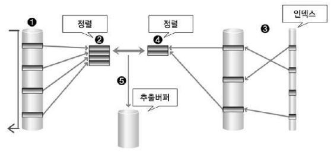
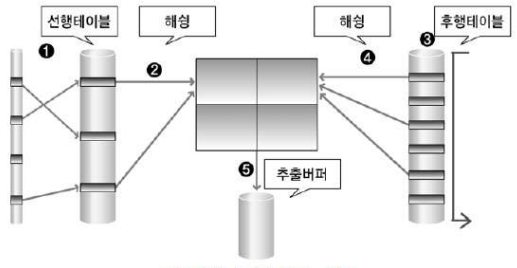

# 제3절 조인 수행 원리

- 조인이란 두 개 이상의 테이블을 하나의 집합으로 만드는 연산
- SQL문에서 FROM에 두 개 이상의 테이블이 나열될 경우 조인 수행
- 조인 연산은 두 테이블 사이에서 수행됨

## 1. NL Join

- 프로그래밍에서 사용하는 중첩된 반복문과 유사한 방식으로 조인 수행

```sql
# 선행 테이블과 후행 테이블 조인
FOR 선행 테이블 (외부 테이블, Outer Table) 읽음
    FOR 후행 테이블 (내부 테이블, Inner Table) 읽음
```

- 결과 행의 수가 적은 테이블을 조인 순서상 선행 테이블로 선택하는 것이 전체 일량을 줄일 수 있음
- 랜덤 방식으로 데이터를 액세스하기 때문에 처리 범위가 좁은 것이 유리
- 성공하면 바로 조인 결과를 사용자에게 보여줄 수 있음
- NL Join 작업 방법
    1. 선행 테이블에서 주어진 조건을 만족하는 행을 찾음
    2. 선행 테이블의 조인 키 값을 가지고 후행 테이블에서 조인 수행
    3. 선행 테이블의 조건을 만족하는 모든 행에 대해 1번 작업 반복 수행


1. 선행 테이블에서 조건을 만족하는 첫 번째 행을 찾음
2. 선행 테이블의 조인 키를 가지고 후행 테이블에 조인 키가 존재하는지 찾으러 감
3. 후행 테이블의 인덱스에 선행 테이블의 조인 키가 존재하는지 확인
4. 인덱스에서 추출한 레코드 식별자를 이용하여 후행 테이블 액세스
5. ~11 앞의 작업 반복 수행

## 2. Sort Merge Join

- 조인 칼럼을 기준으로 데이터를 정렬하여 조인 수행
- NL Join에서 부담되던 넓은 범위의 데이터 처리를 할 때 이용되는 조인
- 정렬할 데이터가 많아 메모리에서 모든 정렬 작업을 수행하기 어려운 경우 임시 영역을 사용하기 때문에 성능이 떨어질 수도 있음
- 동등 조인 뿐만 아니라 비동등 조인에 대해서도 조인 작업 가능



1. 선행 테이블에서 주어진 조건을 만족하는 행을 찾음
2. 선행 테이블의 조인 조건을 기준으로 정렬 작업 수행 (1~2 작업을 선행 테이블의 조건을 만족하는 모든 행에 대해 반복 수행)
3. 후행 테이블에서 주어진 조건을 만족하는 행 찾음
4. 후행 테이블의 조인 키를 기준으로 정렬 작업 수행 (3~4번 작업을 후행 테이블의 조건을 만족하는 모든 행에 대해 반복 수행)
5. 정렬된 결과를 이용하여 조인을 수행하며 조인에 성공하면 추출 버퍼에 넣음

## 3. Hash Join

- 해슁 기법을 이용하여 조인 수행
- 동등 조인에서만 사용 가능
- 조인 작업을 수행하기 위해 해쉬 테이블을 메모리에 생성해야 함
- 선행 테이블을 이용하여 먼저 해쉬 테이블을 생성한다고 해서 선행 테이블을 Build Input 이라고도 함
- 후행 테이블은 만들어진 해쉬 테이블에 대해 해쉬 값의 존재 여부를 검사한다고 해서 Prove Input 이라고도 함



1. 선행 테이블에서 주어진 조건을 만족하는 행 찾음
2. 선행 테이블의 조인 키를 기준으로 해쉬 함수를 적용하여 해쉬 테이블 생성 (1 ~ 2 작업을 선행 테이블의 조건을 만족하는 모든 행에 대해 반복 수행)
3. 후행 테이블에서 주어진 조건을 만족하는 행을 찾음
4. 후행 테이블의 조인 키를 기준으로 해쉬 함수를 적용하여 해당 버킷을 찾음

    → 조인 키를 이용하여 실제 조인될 데이터를 찾음

5. 조인에 성공하면 추출 버퍼에 넣음 (후행 테이블의 조건을 만족하는 3 ~ 5 작업 모든 행에 대해 반복 수행)

<br/>


> 본 포스팅은 SQL 개발자 가이드를 참고하여 작성되었습니다.