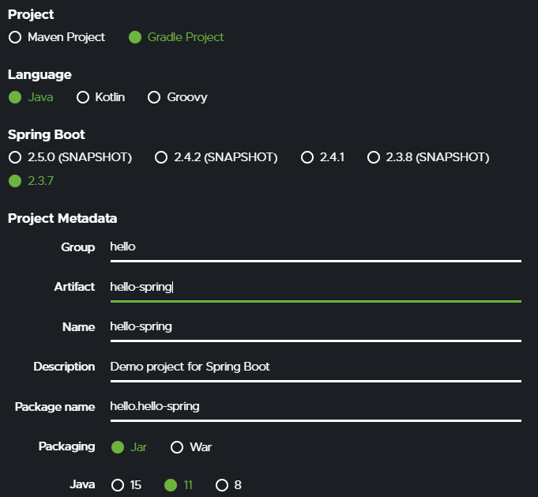
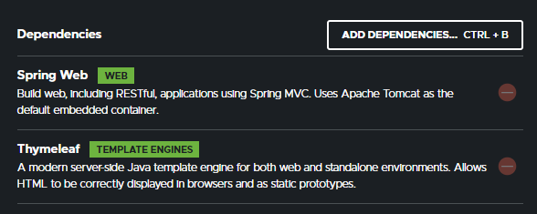
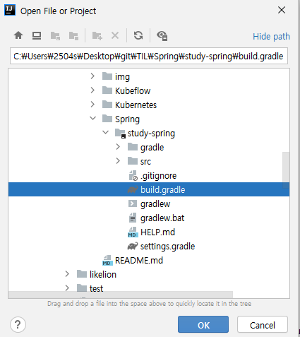
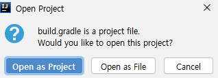
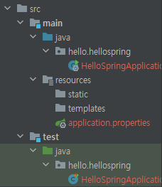
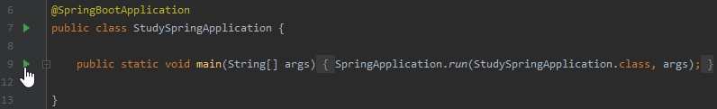
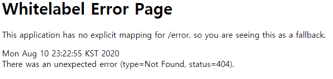
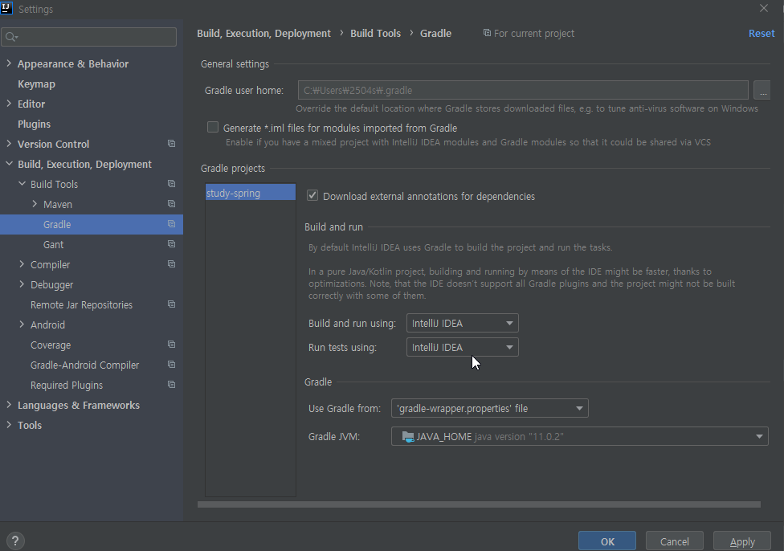
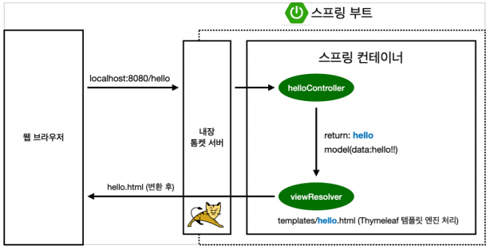

# [스프링 입문] 1. 프로젝트 환경설정

## 1\. 프로젝트 생성

### 1.1 사전 준비물

-   Java 11 설치
-   IDE : IntelliJ 또는 Eclipse 설치
-   기본 환경 세팅

### 1.2 스프링 프로젝트 생성

-   스프링 부트 스타터 사이트로 이동
    
    [Spring Initializr](https://start.spring.io/)
    
-   Project는 `Gradle`로 만들고 (Maven의 경우 최근에는 잘 사용하지 않음. 레거시 버전에서 사용)
    
-   안정적으로 release된 최신 버전인 `2.3.2` 버전의 Spring Boot를 선택.
    
-   Project Metadata의 경우, Group은 보통 회사명을 사용 (여기서는 개인적인 공부를 위한 용도이므로 study로 설정)
    
-   Project Matadata의 Artifact는 빌드된 결과물 (프로젝트명)이며, 나머지는 편하게 설정하면 됨
    
-   설정한 결과는 다음과 같음
    
    

-   사용할 라이브러리 추가하고 `GENERATE` 를 눌러 다운
    
    

-   다운받은 파일의 압축 해제하고 intelliJ 실행시켜 `Open or Import` 클릭하여 다운받은 spring 프로젝트 파일의 `build.gradle` 선택 후 `OK` 누름
    
    

-   `Open as Project` 선택하여 프로젝트 생성!!
    
    

-   `src` 에는 `main` 과 `test` 가 있는데, `main` 에 있는 `java` 는 우리가 작성한 java code를 넣어 놓는 폴더이고, `resources` 는 그 외의 code를 넣어 놓는 폴더. `test` 는 test를 위한 폴더
    
    

-   Application 파일 선택한 후, 실행버튼을 눌러서 main 실행
    
    

-   실행되면 웹브라우저를 열고 `[localhost:8080](http://localhost:8080)` 으로 접속하면, 아래와 같은 화면을 볼 수 있음 (내용이 없기 때문에 error page가 뜨면 환경 설정 성공!)
    
    

-   `setting > Build, Execution, Deployment > Build Tools > Gradle` 에서 `Build and run using` 과 `Run tests using` 을 `intelliJ IDEA` 로 변경하면 Gradle을 거치지 않고 실행되기 때문에 실행 시간을 줄일 수 있음
    
    

## 2\. 라이브러리 살펴보기

Gradle은 의존 관계가 있는 라이브러리를 함께 다운로드

### 2.1 스프링부트 라이브러리

-   spring-boot-starter-web
    -   spring-boot-starter-tomcat: 톰캣 (웹서버)
    -   spring-webmvc: 스프링 웹 MVC
-   spring-boot-starter-thymeleaf: 타임리프 템플릿 엔진(View)
-   spring-boot-starter(공통): 스프링 부트 + 스프링 코어 + 로깅
    -   spring-boot
        -   spring-core
-   spring-boot-starter-logging
    -   logback, slf4j

### 2.2 테스트 라이브러리

-   spring-boot-starter-test
    -   junit: 테스트 프레임워크
    -   mockito: 목 라이브러리
    -   assertj: 테스트 코드를 좀 더 편하게 작성하게 도와주는 라이브러리
    -   spring-test: 스프링 통합 테스트 지원

## 3\. View 환경설정

### 3.1 Welcom Page 만들기

-   Spring Boot가 실행될 때 index.html을 먼저 찾는데, 이 때 index.html은 welcome page
    
    

### 3.2 thymeleaf 템플릿 엔진

-   controller 폴더 생성 후 그 안에 code 입력
    
    (여기서 controller는 MVC의 controller이며, 코드 안의 Model은 MVC의 model)
    
    

-   위의 java 코드에서 호출하는 hello는 아래 hello.html
    
    

-   thymeleaf 템플릿 동작 환경
    
    

    1.  `/hello` 가 들어오면 내장 톰캣 서버에서 `helloController` 로 전달
    2.  컨트롤러는 hello를 mapping 시킬 수 있는 지 확인 후, mapping 가능하면 실행  
        (여기서 GetMapping을 사용했음 - Get 방식)
    3.  Model에 `data` 를 넣고 return 시킴  
        여기서 `hello` 를 return 시키는데, templates/hello.html로 연결됨  
        ⇒ thymeleaf 템플릿 엔진이 처리
-   컨트롤러에서 리턴 값으로 문자를 반환하면 뷰 리졸버( viewResolver )가 화면을 찾아서 처리
    
    -   스프링 부트 템플릿엔진 기본 viewName 매핑
    -   resources:templates/ + `{ViewName}` + .html

## 4\. 빌드하고 실행하기

### 4.1 intelliJ와 Git Bash 연동

[https://goddaehee.tistory.com/250](https://goddaehee.tistory.com/250)

### 4.2 빌드하고 실행시키기

> 본 포스팅은 Inflearn의 [스프링 입문 - 코드로 배우는 스프링 부트, 웹 MVC, DB 접근 기술](https://www.inflearn.com/course/%EC%8A%A4%ED%94%84%EB%A7%81-%EC%9E%85%EB%AC%B8-%EC%8A%A4%ED%94%84%EB%A7%81%EB%B6%80%ED%8A%B8) 강의를 참고하여 작성되었습니다.